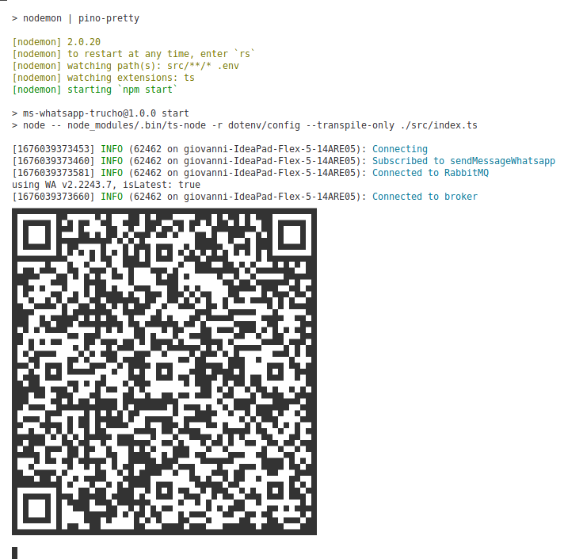

# Whatsapp-Trucho
Este Microservicio se encarga de poder enviar mensajes de whatsapp a otros aun no lo tengan registrado ese numero de telefono como contacto. 

## Ventajas
* No se tenga que ingresar a un entorno web para poder mandar el mensaje.
* Se pueden enviar mensajes de manera automatica cuando se consume un comando.
* El mensaje a enviar puede ser costumizado al 100%
* Al ms se puede aplicar Bottleneck para envios masivos cuando se envia masivamente mensajes.
* Costo 0.

## Desventajas
* Si no se tiene un contacto con el equipo por las de 14 dias la sesion se cierra y se tiene que escanear el codigo QR nuevamente
* Los envio de los mensajes no debe ser identicos cuando se envia masivamente para evitar que whatsapp no bloque el numero de telefono.

# Despliegue

Paso 1: Instalar dependecias y correr el microservicio.
```
> npm i
> npm run dev
```
Paso 2: Escanear el QR de la consola.



Y listo tienes el whatsapp trucho levantado!!

## Mensajeria
Los tipos de mensajes que pueden enviar, son muchos como texto simple, link, emotic:
`Ejemplo`

```
Ejemplo simple
const Text = 'This is a single message'

Ejemplo completo y tambien se puede quitar y aumentar opciones en el mensaje para mas datos:
mas info: https://www.npmjs.com/package/@adiwajshing/baileys
const listMessage = {
  text: "This is a listMessage",
  footer: "nice footer, link: https://google.com",
  title: "Amazing boldfaced list title",
  buttonText: "Required, text on the button to view the list",
  sections
}

sock.sendMessage(id, listMessage || text)
```

## Notas importantes
Los archivos baileys_store_multi.json y baileys_auth_info se autogeneran para la manipular y guardar la informacion de credenciales, sesiones, y log de datos como por ejemplo si el cliente a quien se mando el mensaje ha leido el mensaje.
```